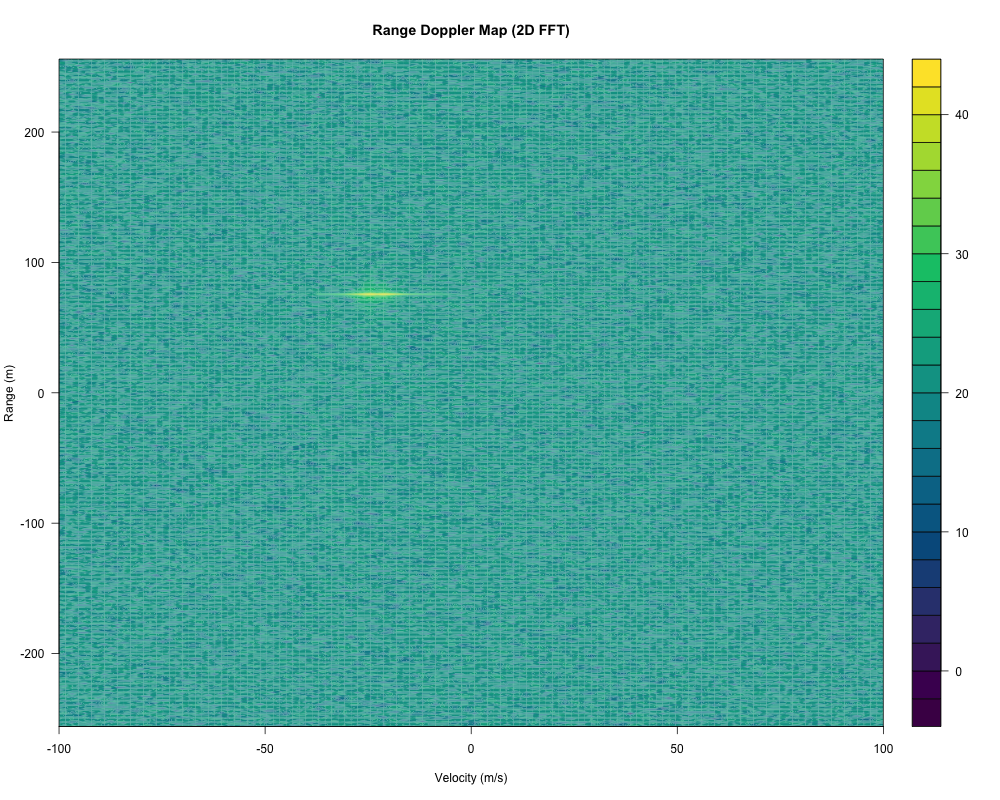
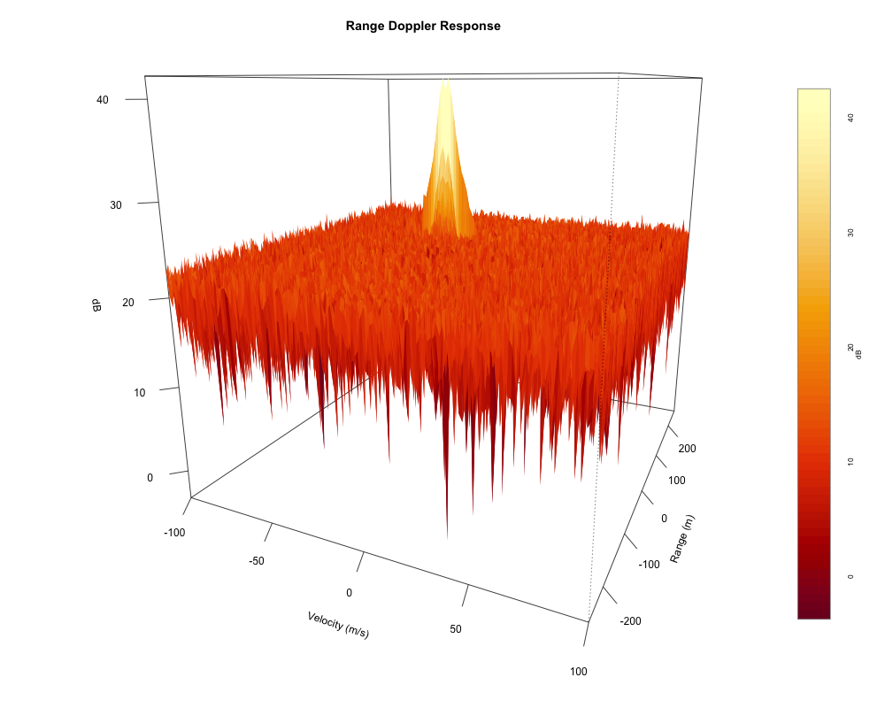
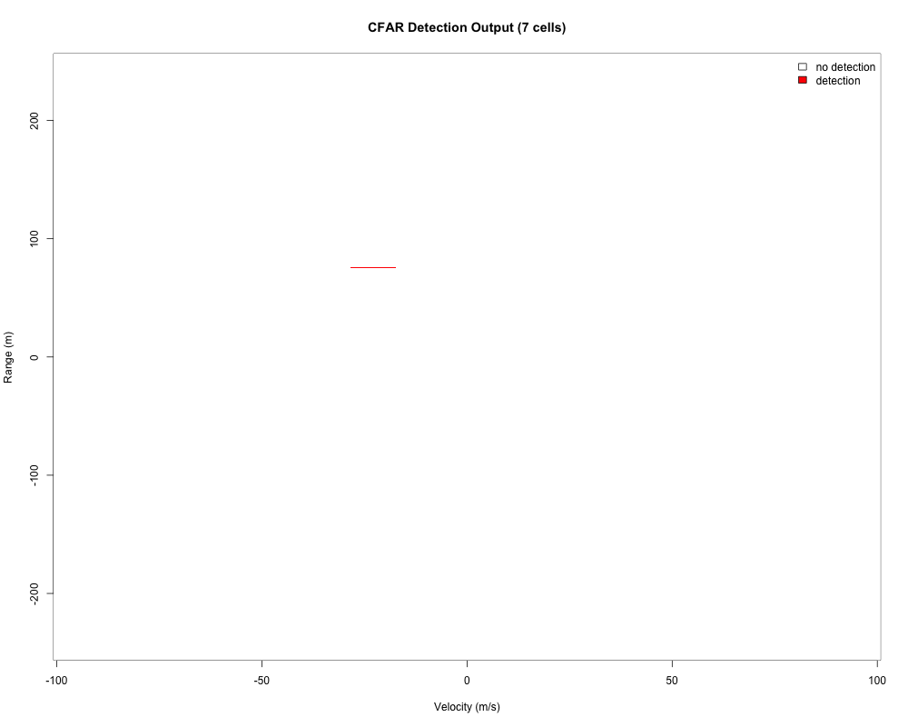
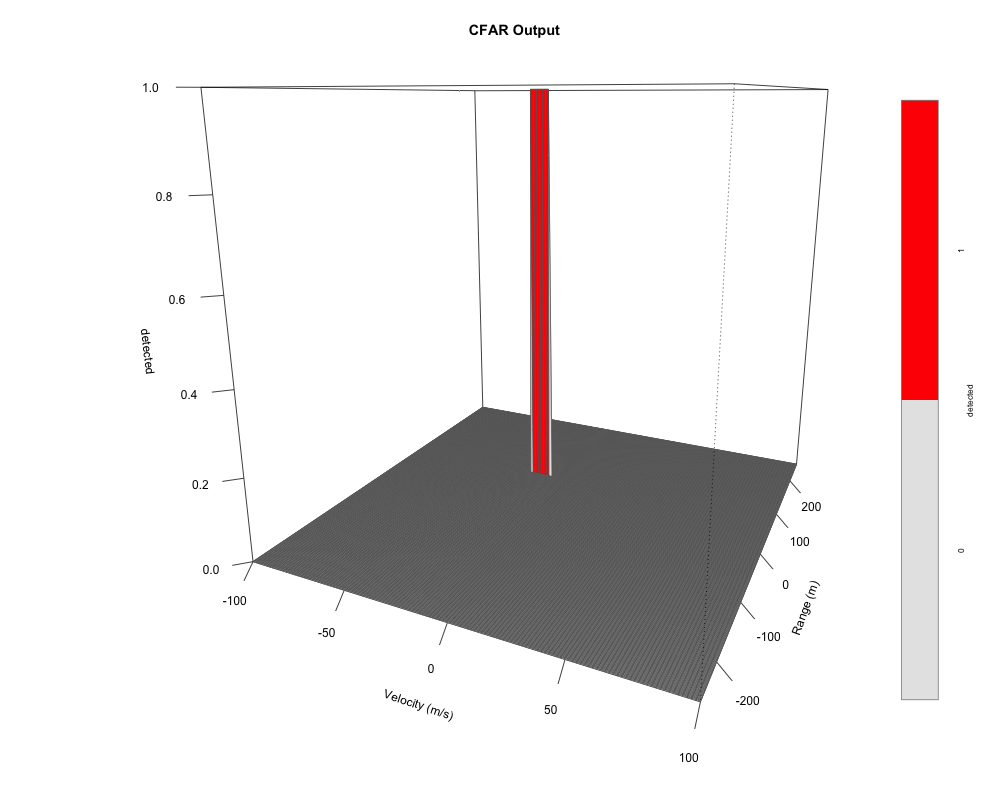

# Radar Target Generation and Detection — Project Report

Establish a complete radar target generation and detection pipeline: FMCW
waveform design, moving target simulation, range measurement (1st FFT),
Range-Doppler processing (2D FFT) and 2D CFAR-based target detection.

## Note on the implementation language (R instead of MATLAB)

This project is implemented in **R**, not MATLAB. Udacity's MATLAB license
for the Sensor Fusion course expired in **April 2026**, so the course
workspace no longer provides access to MATLAB. I tried to port the original MATLAB template (added here under `src/radar-target-generation-and-detection.m`) to R. The implementation uses base R only (`stats` + `graphics`) — no third-party packages are required.

## Project structure

| File | Purpose |
|---|---|
| `src/radar-target-generation-and-detection.m` | Original MATLAB template with open TODOs |
| `src/radar-target-generation-and-detection.R` | R port of the template. |

Run the pipeline with:

```
Rscript src/radar-target-generation-and-detection.R
```

Plots are written as PNG files into `./plots`; in an interactive session
they are shown on screen.
| Plot | Content |
|---|---|
| `plots/00_fmcw_chirp.png` | FMCW waveform visualization (section 1) |
| `plots/00_beat_signal.png` | Beat (mixed) signal in the time domain (section 2) |
| `plots/01_range_fft.png` | Range measurement output of the 1st FFT (section 3) |
| `plots/02_range_doppler_map.png` | Range-Doppler Map, contour view (section 4.1) |
| `plots/03_range_doppler_surface.png` | Range-Doppler Map, surface view (section 4.1) |
| `plots/04_cfar_image.png` | CFAR detection output, image view (section 4.5) |
| `plots/05_cfar_surf.png` | CFAR detection output, surface view (section 4.5) |

## 1. FMCW Waveform Design

**Requirement:** Design the FMCW waveform from the given system requirements
and determine the bandwidth (B), the chirp time (Tchirp) and the chirp
slope. For the given requirements the calculated slope should be
approximately **2 × 10^13**.

System requirements:

- Carrier frequency: 77 GHz
- Maximum range: 200 m
- Range resolution: 1 m
- Maximum velocity: 100 m/s

Design:

- **Bandwidth** from the range resolution:
  `B = c / (2 * range_res) = 3e8 / 2 = 150 MHz`
- **Chirp time**, sized for the maximum range with a ~10% safety margin for
  the beat signal to be resolvable (factor 5.5 = 2 × 1.1 × 2.5, the common
  value used in the course):
  `Tchirp = 5.5 * (2 * max_range / c) = 5.5 * 1.33e-6 ≈ 7.33 µs`
- **Slope**:
  `slope = B / Tchirp = 150e6 / 7.33e-6 ≈ 2.045e13 Hz/s`

Implementation: `src/radar-target-generation-and-detection.R`, section
*FMCW Waveform Generation* — the script computes and prints the parameters:

```
FMCW waveform design:
  Bandwidth  B      = 150.0 MHz
  Chirp time Tchirp = 7.333 us
  Slope      slope  = 2.0455e+13 Hz/s
```

The slope of ≈ **2.045 × 10^13** meets the rubric requirement of approximately 2 × 10^13.

Visualization:


1. Transmitted chirp — instantaneous frequency `fc + slope*t` over two
   chirps (77 → 77.15 GHz in 7.33 µs per chirp).
2. Tx ramp vs the delayed Rx ramp for the target's initial position —
   the vertical offset between the ramps is the beat frequency
   `fb = slope * 2R/c = 10.23 MHz`.
3. Beat frequency over one chirp — essentially constant, it encodes
   range: `R = fb * c / (2 * slope) = 75 m`, the frequency the range FFT
   (task 3) will detect. (The approaching target lets fb fall by only
   ~25 Hz over the chirp, negligible against 10.23 MHz.) The target
   velocity is not visible within a single chirp; it shows up as a phase
   shift between consecutive chirps.

## 2. Simulation Loop

**Requirement:** Simulate the target movement and compute the beat (mixed)
signal for every time step. The beat signal must produce the correct range
after the range FFT, i.e. the target's initial position within a ±10 m
tolerance.

Target definition:

- Initial position: 75 m
- Constant radial velocity: -25 m/s (negative = approaching)

Following the wave equations of the course theory, the transmitted signal
is the FMCW chirp and the received signal is its time-delayed version
(`t` replaced by `t - td`, with the round-trip delay `td = 2R/c` for the
target range `R`):

```
Tx = cos(2*pi*(fc*t + 0.5*slope*t^2))
Rx = cos(2*pi*(fc*(t-td) + 0.5*slope*(t-td)^2))
```

Mixing (`Mix = Tx * Rx`, element-wise) corresponds to a frequency
subtraction. In its idealized form — the equation the course derives
from the mixing step — the beat signal is the single tone at the range
beat frequency `fb = 2*slope*R/c` plus the Doppler shift
`fd = 2*fc*v/c`:

```
Mix = Tx * Rx = cos(2*pi*((2*slope*R/c) + (2*fc*v/c))*t))
```

The implementation computes the literal physical product:
the target range is updated at every time stamp (`r_t = target_range0 +
target_vel * t`, `td = 2 * r_t / c`) and the transmitted and received
signals are mixed element-wise (vectorized; the course template runs
this as a per-sample loop). Compared with the idealized equation this
has two visible consequences: the sum-frequency term of the analog
multiplication, and the beat-frequency drift of the per-sample range
update, which smears the Doppler energy (-29.1 m/s measured at the RDM
peak vs. -25.0 m/s theoretical, section 4.1). The range measurement is
unaffected: the range FFT peak sits at the target's initial position
(75 m, section 3). Both effects shape the Range-Doppler Map and its
locally structured floor is filtered by the 2D CFAR of section 4.

Visualization:


1. The complete first chirp — the beat tone oscillates at `fb + fd`, the
   range beat frequency plus the small Doppler shift (≈ 10.21 MHz for the
   target's initial position).
2. A zoom on the first microsecond — the individual beat cycles with a
   period of ≈ 98 ns, i.e. the beat tone that encodes the 75 m range and
   that the range FFT (see task 3 below) extracts as a peak.

## 3. Range FFT (1st FFT)

**Requirement:** Implement the range FFT on the beat signal and plot the
result. A correct implementation must produce a peak at the correct range,
i.e. the target's initial position within a ±10 m tolerance.

The beat signal is reshaped into an `Nr × Nd` matrix (column-major, matching
MATLAB's `reshape`: column `j` holds chirp `j`). The FFT of the first chirp
is taken along the range dimension, normalized by `Nr`, converted to
magnitude and cut to one side of the double-sided spectrum:

```
sig_fft = |FFT(Mix2D[, 1]) / Nr|, first Nr/2 samples
```

Bin `k` corresponds to `k * c / (2B) = k * 1 m` of range. The resulting
plot (`plots/01_range_fft.png`) shows a clear single peak at
**≈ 75 m — the target's initial position** (tolerance ±10 m: satisfied).

The script reports the detected peak:

```
Range FFT peak: bin 75 -> 75.0 m (target_range0 = 75 m)
```

Visualization:


## 4. 2D-CFAR (2D Constant False Alarm Process)

**Requirement:** Implement the 2D CFAR process on the output of the 2D FFT
(the Range-Doppler Map). The processing must suppress the noise and filter
out the target signal; the result should match the image shown in the
walkthrough.

The task is a sequence of steps, each building on the previous one: the
Range-Doppler Map as the input (4.1), the CFAR window parameters (4.2),
the noise estimation and threshold (4.3), the detection decision with
edge suppression (4.4) and the CFAR output (4.5).

### 4.1 Range Doppler Map

The input to the CFAR is the Range-Doppler Map, generated by a 2D FFT of
the beat-signal matrix: an FFT along the range dimension (per chirp), then
an FFT along the Doppler dimension (across the 128 chirps), one side of
the spectrum in the range dimension, `fftshift` in both dimensions and
`10*log10` of the magnitude.

The physical simulation (section 2) places the target peak at 75.0 m with
a measured Doppler of -29.1 m/s, while the theoretical formula predicts
`fd = 2*fc*v/c` → -25.0 m/s: the theory holds the range constant within
the frame, whereas the simulation updates the range at every time stamp,
which chirps the beat frequency and spreads the target's Doppler energy
over neighbouring bins. The map also contains the sum-frequency term of
the mixing product (an FMCW mixer produces the difference and the sum
tone) as a second, weaker structure. This locally structured floor will
be handled by the CFAR's adaptive threshold. The physical velocity follows
from the Doppler bin via `fd = bin/(Nd*Tchirp)`, `v = fd*c/(2*fc)` — the
conversion the script uses to report the strongest RDM cell:

```
RDM peak (target): range = 75.0 m, velocity = -29.1 m/s
Theoretical velocity from fd = 2*fc*v/c: -25.0 m/s
```

Visualization:




1. Contour view (`filled.contour`) — the target appears as a compact peak
   at ≈ 75 m against the noise floor.
2. Surface view (`persp`) — the same map in 3D, the facets
   colored by level (heatmap palette `YlOrRd`), with a color scale at
   the right edge.

### 4.2 CFAR parameters: training cells, guard cells and offset

| Parameter | Value | Rationale |
|---|---|---|
| `Tr` (range training cells, per side) | 10 | Enough cells for a stable noise average; window stays small enough to track the locally flat noise floor. |
| `Td` (Doppler training cells, per side) | 4 | Same reasoning along the Doppler axis; kept smaller because the Doppler guard below is wide. |
| `Gr` (range guard cells, per side) | 3 | Keeps the target's own energy (FFT leakage around the peak) out of the training cells. |
| `Gd` (Doppler guard cells, per side) | 20 | The physical signal model smears the target's Doppler energy over several bins (section 4.1); the wide Doppler guard keeps that smeared target energy out of the training ring so it cannot inflate the threshold. |
| `offset` (threshold offset) | 14 dB | The offset trades detection sensitivity against false alarms. Measured with this training window: 10 dB → 17 detections (including leakage cells beyond the target's Doppler smear), 14-16 dB → 7 (exactly the smeared Doppler bins, including the leading edge), 18 dB → 5, 20 dB → 2, 22 dB → target lost. 14 dB covers the full smear — including its leading edge, which carries the frame-start Doppler — without picking up leakage cells. |

### 4.3 Noise estimation and threshold

The RDM (dB) is converted to linear power (`RDM_pow = 10^(RDM/10)`, the
equivalent of MATLAB's `db2pow`) and the CFAR output matrix is initialized
with zeros, same size as the RDM.

The cell under test (CUT) slides across the whole map, leaving margins of
`Tr+Gr` cells in the range dimension and `Td+Gd` cells in the Doppler
dimension, so that a full training window always fits inside the map. For
each CUT position the training cells are the ring between the training
window `(2*(Tr+Gr)+1) × (2*(Td+Gd)+1)` and the guard block
`(2*Gr+1) × (2*Gd+1)` — 1,036 cells for this configuration. The linear power
is summed over the training ring and averaged by their number; the average
is converted back to dB (`10*log10(...)`, the equivalent of MATLAB's
`pow2db`) and the offset is added — this is the detection threshold.

### 4.4 Detection decision and edge suppression

For every CUT position the RDM level is compared with the threshold: if
the CUT level exceeds it, the output cell is set to 1, otherwise to 0.

Because the CUT cannot be placed at the map edges (the training and guard
window would extend outside the matrix), the thresholded block is smaller
than the Range-Doppler Map. To keep the CFAR output the same size as the
RDM, the CFAR matrix is initialized with zeros and only the interior block
is written by the sliding loop — all cells that are never tested (the edge
margins) therefore keep the value 0, i.e. "no detection", by construction.

### 4.5 CFAR output

With this configuration the CFAR output contains 7 detections out of
65,536 cells — a compact cluster at the target position (75.0 m, spread
over the smeared Doppler bins from ≈ -37 to ≈ -25 m/s) — and suppresses
the noise and the structured floor everywhere else, matching the
walkthrough result. The script reports:

```
CFAR detections: 7 of 65536 cells
Strongest detection: range = 75.0 m, velocity = -29.1 m/s
Doppler leading edge: -24.9 m/s (frame-start Doppler)
```

As a final step the target's velocity is read from the *leading edge*
of the detection cluster instead of a mean over the cluster: the
physical simulation drifts the beat frequency steadily within the
frame, in the direction of the target's relative velocity — toward more
negative Doppler for the approaching target here — so the per-chirp
phase increment at the frame start is the pure Doppler shift
`fd = 2*fc*v/c`. The cluster edge on the undrifted side (the
least-negative detected Doppler bin for an approaching target;
the most-negative one for a receding target) therefore recovers the
target's undrifted velocity: **-24.9 m/s, within 0.1 m/s of the
theoretical -25.0 m/s**. A mean over the cluster, in contrast, would
sit at the energy midpoint of the smear (≈ -31 m/s) regardless of the
CFAR parameters. This is also why the offset is set to 14 dB — the
smallest offset whose detection cluster covers the full smear including
this leading edge.

The values of the detected bins show the coverage directly — all seven
bins sit at the target's range bin (75.0 m) and span the smeared Doppler
from -37.4 up to -24.9 m/s, the leading edge carrying the target's
velocity:

```
Detected target bins:
  range =  75.0 m, velocity =  -37.4 m/s, level = 37.8 dB
  range =  75.0 m, velocity =  -35.3 m/s, level = 40.5 dB
  range =  75.0 m, velocity =  -33.2 m/s, level = 42.1 dB
  range =  75.0 m, velocity =  -31.1 m/s, level = 40.5 dB
  range =  75.0 m, velocity =  -29.1 m/s, level = 42.2 dB
  range =  75.0 m, velocity =  -27.0 m/s, level = 40.5 dB
  range =  75.0 m, velocity =  -24.9 m/s, level = 37.8 dB
```

Visualization:




1. Image view — red cells mark the detections.
2. Surface view of the binary detection map — red facets mark
   the detections; the color scale reads 0 = no detection, 1 = detection.

## Results

Running `Rscript src/radar-target-generation-and-detection.R` prints and
plots:

```
FMCW waveform design:
  Bandwidth  B      = 150.0 MHz
  Chirp time Tchirp = 7.333 us
  Slope      slope  = 2.0455e+13 Hz/s
Range FFT peak: bin 75 -> 75.0 m (target_range0 = 75 m)
RDM peak (target): range = 75.0 m, velocity = -29.1 m/s
Theoretical velocity from fd = 2*fc*v/c: -25.0 m/s
CFAR detections: 7 of 65536 cells
Strongest detection: range = 75.0 m, velocity = -29.1 m/s
Doppler leading edge: -24.9 m/s (frame-start Doppler)
Detected target bins:
  range =  75.0 m, velocity =  -37.4 m/s, level = 37.8 dB
  range =  75.0 m, velocity =  -35.3 m/s, level = 40.5 dB
  range =  75.0 m, velocity =  -33.2 m/s, level = 42.1 dB
  range =  75.0 m, velocity =  -31.1 m/s, level = 40.5 dB
  range =  75.0 m, velocity =  -29.1 m/s, level = 42.2 dB
  range =  75.0 m, velocity =  -27.0 m/s, level = 40.5 dB
  range =  75.0 m, velocity =  -24.9 m/s, level = 37.8 dB
```

- FMCW slope ≈ 2.045e13 Hz/s — rubric value of ~2e13 met.
- Range FFT peak and CFAR detection at 75.0 m vs. simulated initial
  position of 75 m — within the ±10 m tolerance, and in agreement with
  the theoretical beat frequency `fb = 2*slope*R/c`.
- CFAR velocity estimate vs. theoretical -25.0 m/s (`fd = 2*fc*v/c`):
  the leading edge of the detection cluster — the frame-start Doppler,
  on the side opposite the smear direction — recovers -24.9 m/s, within
  0.1 m/s of the theory. The smear itself is the documented difference
  between the theory and the physical simulation (section 4.1).
- Note on the plot axes: the plots keep the axis formula of the course
  template (`doppler_axis = linspace(-100, 100, Nd)`), which labels the
  128 Doppler bins as ±100 m/s, while the physics of the waveform gives
  ≈ 2.08 m/s per bin. On that template axis the target peak reads as
  ≈ -21 m/s; the reported velocities always use the physical conversion.
