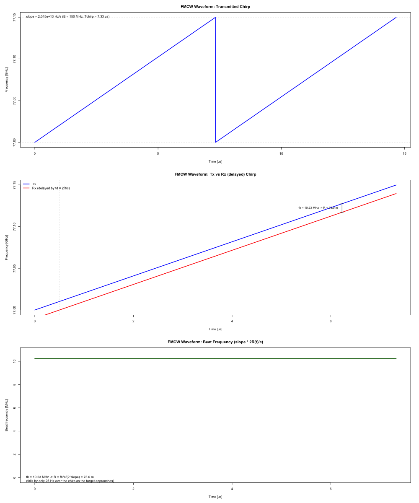
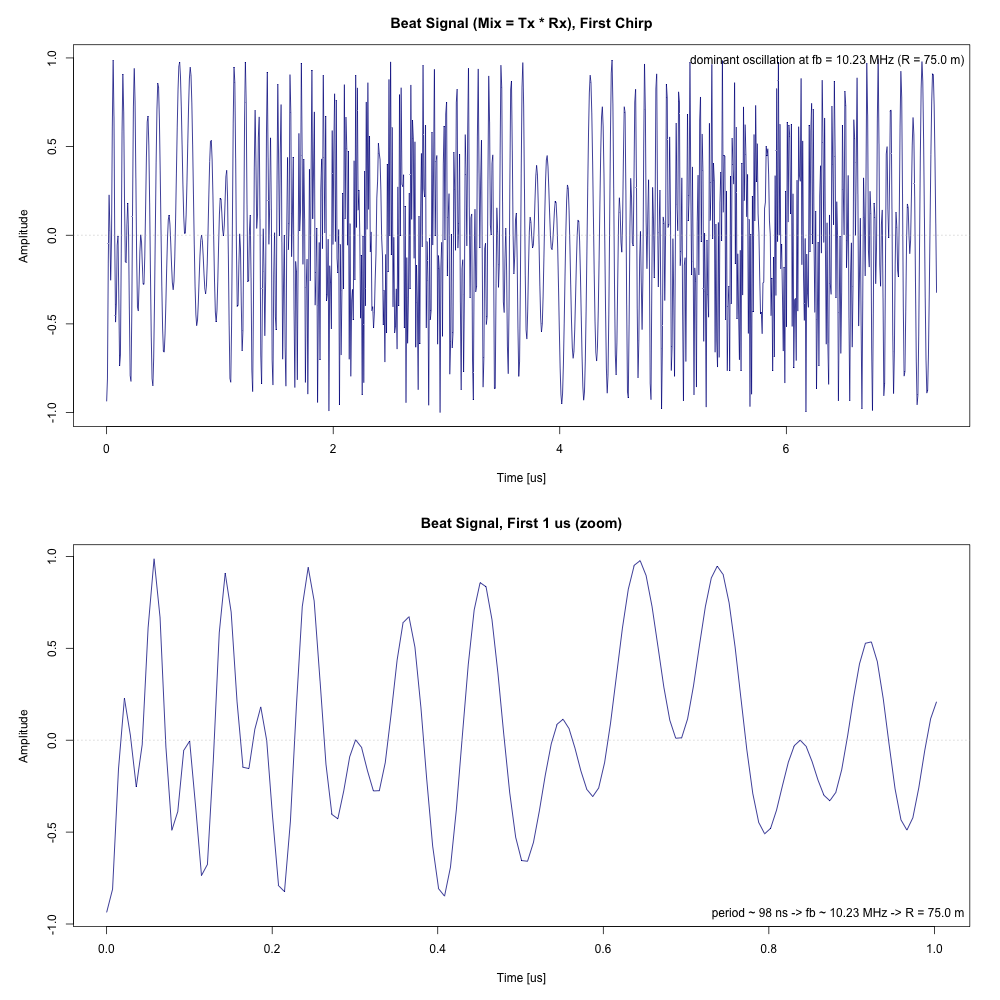
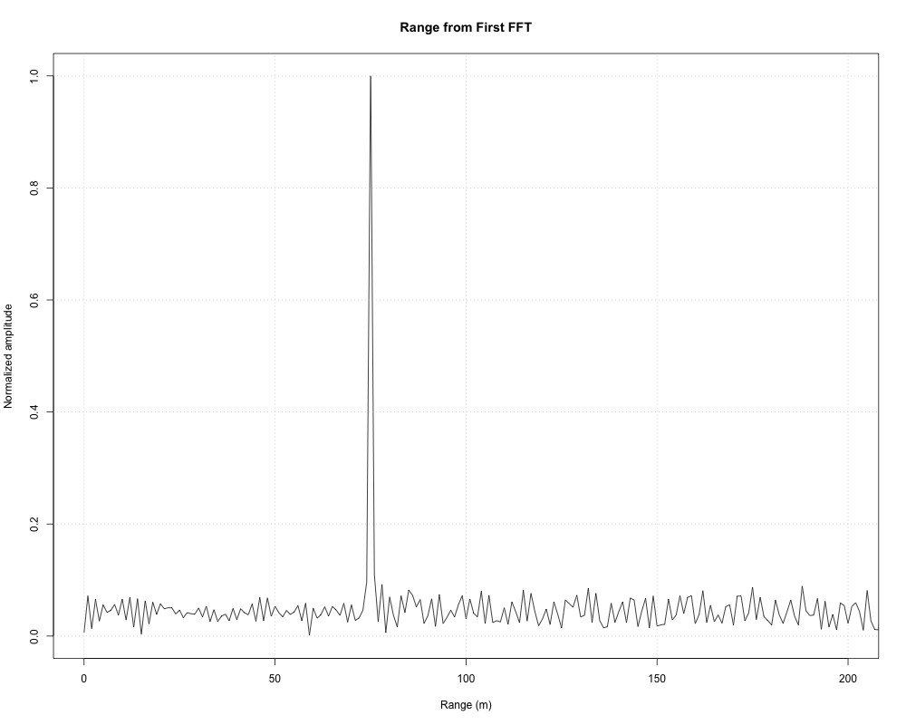

# Radar Target Generation and Detection — Project Report

Establish a complete radar target generation and detection pipeline: FMCW
waveform design, moving target simulation, range measurement (1st FFT),
Range-Doppler processing (2D FFT) and 2D CFAR-based target detection.

## Note on the implementation language (R instead of MATLAB)

This project is implemented in **R**, not MATLAB. Udacity's MATLAB license
for the Sensor Fusion course expired in **April 2026**, so the course
workspace no longer provides access to MATLAB. I tried to port the original MATLAB template (added here under `src/radar-target-generation-and-detection.m`) to R. The implementation uses base R only (`stats` + `graphics`) — no third-party packages are required.

## Project structure

| File | Purpose |
|---|---|
| `src/radar-target-generation-and-detection.m` | Original MATLAB template with open TODOs |
| `src/radar-target-generation-and-detection.R` | R port of the template. |

Run the pipeline with:

```
Rscript src/radar-target-generation-and-detection.R
```

Plots are written as PNG files into `./plots`; in an interactive session
they are shown on screen.
| Plot | Content |
|---|---|
| `plots/00_fmcw_chirp.png` | FMCW waveform visualization (section 1) |
| `plots/00_beat_signal.png` | Beat (mixed) signal in the time domain (section 2) |
| `plots/01_range_fft.png` | Range measurement output of the 1st FFT (section 3) |

## 1. FMCW Waveform Design

**Requirement:** Design the FMCW waveform from the given system requirements
and determine the bandwidth (B), the chirp time (Tchirp) and the chirp
slope. For the given requirements the calculated slope should be
approximately **2 × 10^13**.

System requirements:

- Carrier frequency: 77 GHz
- Maximum range: 200 m
- Range resolution: 1 m
- Maximum velocity: 100 m/s


Design:

- **Bandwidth** from the range resolution:
  `B = c / (2 * range_res) = 3e8 / 2 = 150 MHz`
- **Chirp time**, sized for the maximum range with a ~10% safety margin for
  the beat signal to be resolvable (factor 5.5 = 2 × 1.1 × 2.5, the common
  value used in the course):
  `Tchirp = 5.5 * (2 * max_range / c) = 5.5 * 1.33e-6 ≈ 7.33 µs`
- **Slope**:
  `slope = B / Tchirp = 150e6 / 7.33e-6 ≈ 2.045e13 Hz/s`

Implementation: `src/radar-target-generation-and-detection.R`, section
*FMCW Waveform Generation* — the script computes and prints the parameters:

```
FMCW waveform design:
  Bandwidth  B      = 150.0 MHz
  Chirp time Tchirp = 7.333 us
  Slope      slope  = 2.0455e+13 Hz/s
```


The slope of ≈ **2.045 × 10^13** meets the rubric requirement of approximately 2 × 10^13.

Visualization:


1. Transmitted chirp — instantaneous frequency `fc + slope*t` over two
   chirps (77 → 77.15 GHz in 7.33 µs per chirp).
2. Tx ramp vs the delayed Rx ramp for the target's initial position —
   the vertical offset between the ramps is the beat frequency
   `fb = slope * 2R/c = 10.23 MHz`.
3. Beat frequency over one chirp — essentially constant, it encodes
   range: `R = fb * c / (2 * slope) = 75 m`, the frequency the range FFT
   (task 3) will detect. (The approaching target lets fb fall by only
   ~25 Hz over the chirp, negligible against 10.23 MHz.) The target
   velocity is not visible within a single chirp; it shows up as a phase
   shift between consecutive chirps.


## 2. Simulation Loop

**Requirement:** Simulate the target movement and compute the beat (mixed)
signal for every time step. The beat signal must produce the correct range
after the range FFT, i.e. the target's initial position within a ±10 m
tolerance.

Target definition:

- Initial position: 75 m
- Constant radial velocity: -25 m/s (negative = approaching)

For every time stamp `t` the target range is updated for constant velocity
(`r_t = target_range0 + target_vel * t`) and the round-trip delay is
computed (`td = 2 * r_t / c`). The transmitted signal is a single FMCW
chirp,

```
Tx(t) = cos(2*pi*(fc*t + 0.5*slope*t^2))
Rx(t) = cos(2*pi*(fc*(t-td) + 0.5*slope*(t-td)^2))
```

and the beat signal is the element-wise product of Tx and Rx (the mixing
process of the template):

```
Mix = Tx * Rx
```

Visualization:



1. The complete first chirp — the beat signal oscillates dominantly at
   the beat frequency `fb = 10.23 MHz`, superimposed with the fast
   sum-frequency term of the mixing product.
2. A zoom on the first microsecond — the individual beat cycles with a
   period of ≈ 98 ns, i.e. `fb ≈ 10.23 MHz`, the frequency that encodes
   the 75 m range and that the range FFT (see task 3 below) extracts as a peak.

## 3. Range FFT (1st FFT)

**Requirement:** Implement the range FFT on the beat signal and plot the
result. A correct implementation must produce a peak at the correct range,
i.e. the target's initial position within a ±10 m tolerance.

The beat signal is reshaped into an `Nr × Nd` matrix (column-major, matching
MATLAB's `reshape`: column `j` holds chirp `j`). The FFT of the first chirp
is taken along the range dimension, normalized by `Nr`, converted to
magnitude and cut to one side of the double-sided spectrum:

```
sig_fft = |FFT(Mix2D[, 1]) / Nr|, first Nr/2 samples
```

Bin `k` corresponds to `k * c / (2B) = k * 1 m` of range. The resulting
plot (`plots/01_range_fft.png`) shows a clear single peak at
**≈ 75 m — the target's initial position** (tolerance ±10 m: satisfied).

The script reports the detected peak:

```
Range FFT peak: bin 75 -> 75.0 m (target_range0 = 75 m)
```

Visualization:


